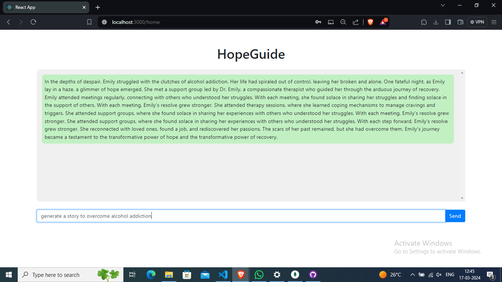
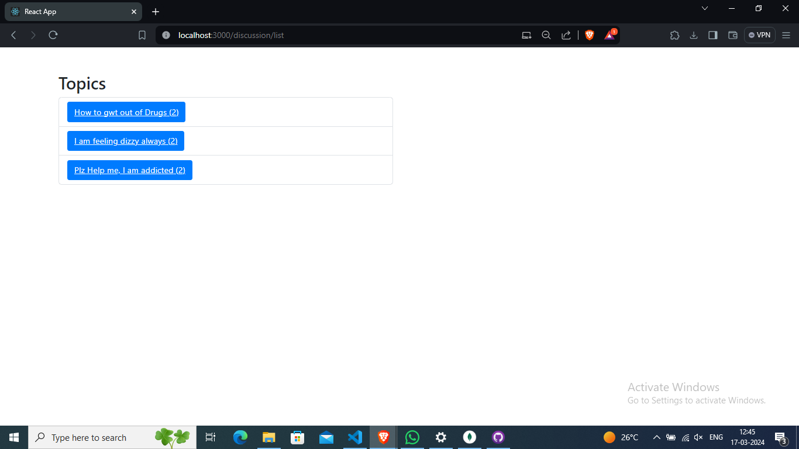
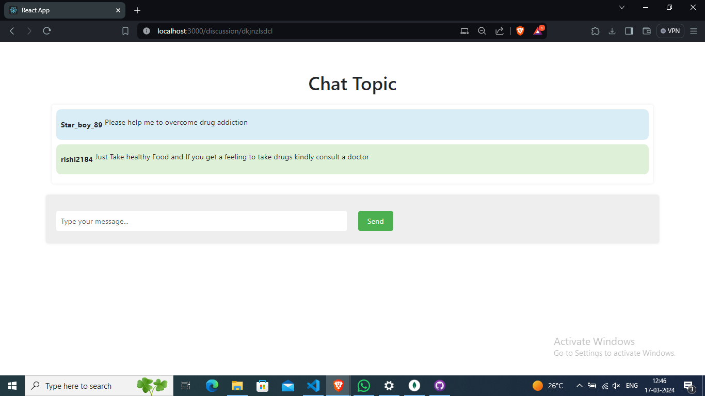

# Life Redemption

Life Redemption is a project aimed at helping people who are addicted to drugs. It provides a community platform where individuals can share about living a drug-free life, and includes a chatbot for discussions about symptoms, positive stories, and the negative consequences of drug use. Additionally, there's a discussion page where recovering addicts can ask questions and receive answers from those who have overcome addiction.

## Team Name:
MODEL MINDS

## Team Members:
1. Sachin A
2. Rishi Kumar S

## Demo Video

https://github.com/Rishirk2107/Model-Minds-IIITDM/assets/120192740/0cf98b8b-d26a-4ff8-8922-35e8f1db6c52

## Demo Website(Using AWS EC2)
http://13.235.245.167:3000/

## Repository

https://github.com/Rishirk2107/Model-Minds-IIITDM.git

## Presentation

https://docs.google.com/presentation/d/1WvNSJ7YydOG8yk-zi8XivZVxkTM28c1ACtTr-6pROqg/edit?usp=sharing

## Screenshots








#Tech Stack Used:
1. Node.js
2. React.js
3. Express.js
4. Pytorch
5. Tensorflow
6. Transformers
7. Large Language Model (LLM)
8. MongoDB
9. AWS Services

## Running the Project Locally
To run the project locally, follow these steps:

1. Clone the repository:
   ```
   git clone https://github.com/your-username/life-redemption.git
   ```
2. Navigate to the project directory:
    ```
   cd life-redemption
    ```
3. Install dependencies for backend:
    ```
     npm install
    ```
4. Start the server:
    ```
    npm start
    ```
# In another terminal:

6. Go inside front-end:
    ```
    cd front-end
    ```
10. Install dependencies for front-end:
    ```
    npm install
    ```
14. Start React.js app:
    ```
    npm start
    ```
16. Open your browser and go to:
    ```
    http://localhost:3000
    ```
